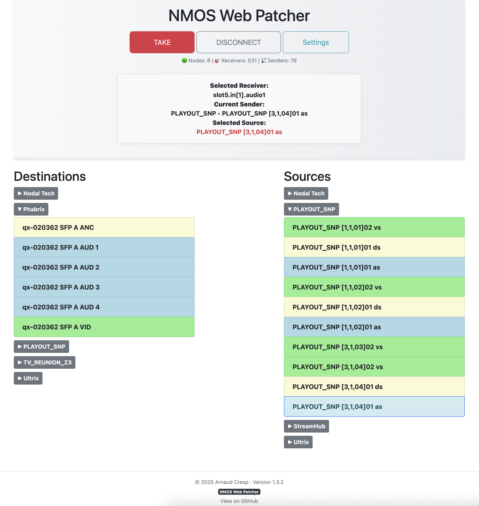

# NMOS Web Patcher

A minimal NMOS IS04/IS-05 patchbay — built for engineers who like to keep things clean and simple.

<p align="center">
  
</p>

---

## Features

- Auto-detection of supported NMOS IS-04 and IS-05 versions per node
- Visual routing interface (senders ↔ receivers)
- Supports IS-05 `activate_immediate` flow switching
- Color-coded flow types (video, audio, ancillary, metadata)
- Lightweight node manager: add, edit, delete, version detection
- Compatible with devices from Imagine, Ross, Blackmagic, Phabrix, and others
- Modular Flask-based architecture for maintainability and extensibility
- REST API available for automation and external integrations ([API Documentation](docs/API.md))

---

## Quick Start

### Requirements

- Python 3.9 or newer
- At least one NMOS IS-04/IS-05 compatible device

### Setup

```bash
git clone https://github.com/acresp/nmos-web-patcher.git
cd nmos-web-patcher
pip install -r requirements.txt
python nmos-web-patcher.py
```
Then visit http://localhost:5000 in your browser and add your first NMOS node in the Settings page :)

---

## Device compatibility

The application has been tested and is able to patch signals with the following hardware:

* Imagine Communications SNP Processor
* Ross Ultrix IPX card
* Blackmagic Decklink IP
* Blackmagic Converters (2110 to HDMI & 3x3G)
* Phabrix Qx
* Riedel/Embrionix emSFP

## ToDo

* Bugs fixes
* Other protocols
* Sky is the limit...

## License

Copyright © Arnaud Cresp

## One more thing...

Wherever you're patching from — if this tool helped, say hi or open an issue. I'd love to hear where it's being used.

<p align="center">
Want to support me ? :)<br>
  <a href="https://coff.ee/acresp" target="_blank">
    
  </a>
</p>