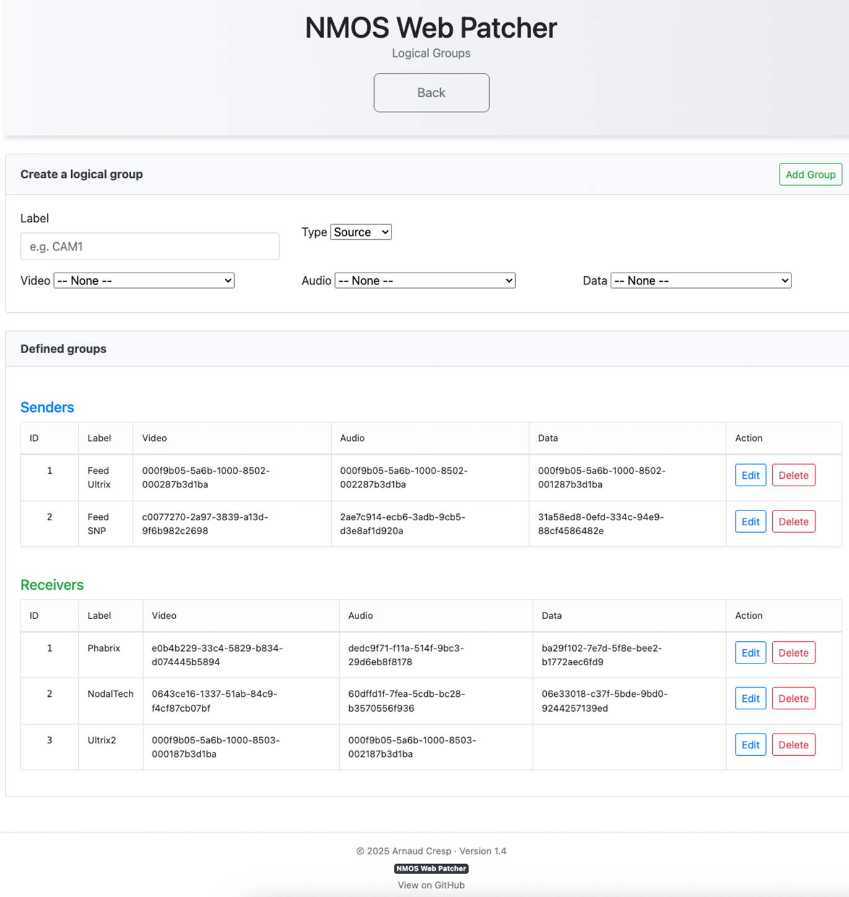

# NMOS Web Patcher – REST API Documentation

## Overview

This API allows remote routing of NMOS senders to receivers based on logical groups defined in the "Logical Groups" settings page. All endpoints require that the REST API checkbox is enabled in "Other Settings".
Here is a view of the Logical Groups page populated with some examples.

<p align="center">
  
</p>

---

## Endpoints

### `GET /api/ping`

Simple health check.

- **Returns**: `{ "status": "ok" }`

---

### `GET /api/list`

Returns the list of logical sources and receivers.

- **Response:**

```json
{
  "sources": [
    { "id": 1, "name": "Feed Ultrix" },
    { "id": 2, "name": "Feed SNP" }
  ],
  "receivers": [
    { "id": 1, "name": "Phabrix" },
    { "id": 2, "name": "NodalTech" },
    { "id": 3, "name": "Ultrix2" }
  ],
  "status": "ok"
}
```

---

### `GET /api/take?src=<id>&dest=<id>`

Route all essences from a logical source to a logical receiver.

- **Parameters**:
  - `src`: ID of logical source
  - `dest`: ID of logical receiver
- **Response:**

```json
{
  "status": "ok",
  "source_name": "Feed SNP",
  "destination_name": "Phabrix",
  "patch_code": "111",
  "patched": {
    "video": { "status": "success", "sender": "...", "receiver": "...", "message": "..." },
    "audio": { "status": "success", "sender": "...", "receiver": "...", "message": "..." },
    "data":  { "status": "success", "sender": "...", "receiver": "...", "message": "..." }
  }
}
```

- **Patch code**: 3-digit string `VAD` (video/audio/data), where each bit is 1 if patch succeeded, 0 otherwise.

---

### `GET /api/take_many?src=<id>&dest=<id1,id2,...>`

Routes a source to **multiple receivers**.

- **Parameters**:
  - `src`: logical source ID
  - `dest`: comma-separated receiver IDs
- **Response:**

```json
{
  "status": "ok",
  "source_name": "Feed SNP",
  "results": [
    {
      "dest_id": 1,
      "receiver_name": "Phabrix",
      "patch_code": "111",
      "status": "ok",
      "patched": { ... }
    },
    {
      "dest_id": 2,
      "receiver_name": "NodalTech",
      "patch_code": "111",
      "status": "ok",
      "patched": { ... }
    }
  ]
}
```

---

### `GET /api/disconnect?dest=<id>`

Disconnect a logical receiver from its current sender for all essences.

- **Parameters**:
  - `dest`: logical receiver ID
- **Response:**

```json
{
  "status": "ok",
  "receiver_name": "NodalTech",
  "disconnected": {
    "video": { "status": "success", "receiver": "...", "message": "..." },
    "audio": { "status": "success", "receiver": "...", "message": "..." },
    "data":  { "status": "success", "receiver": "...", "message": "..." }
  }
}
```

---

### `GET /api/status?dest=<id>`

Returns the currently active sender UUIDs for each essence on a logical receiver, and attempts to deduce the logical source name (if all match).

- **Parameters**:
  - `dest`: logical receiver ID
- **Response:**

```json
{
  "status": "ok",
  "receiver_name": "Phabrix",
  "active": {
    "video": {
      "sender_id": "c0077270-2a97-3839-a13d-9f6b982c2698"
    },
    "audio": {
      "sender_id": "2ae7c914-ecb6-3adb-9cb5-d3e8af1d920a"
    },
    "data": {
      "sender_id": "31a58ed8-0efd-334c-94e9-88cf4586482e"
    }
  },
  "source_name": "Feed SNP"
}
```

> If no exact match with a known logical source is found, `source_name` will be `null`.

---

## Notes

- All routing uses the current contents of `data_logical.json`.
- Ensure `settings.json` contains `"enable_restapi": true`.
- `patch_code` is useful to interpret multi-essence patch success at a glance.
- Additional endpoints (status overview, dry-run) can be considered in future versions.

---

*Last updated: 2025-06-11*
